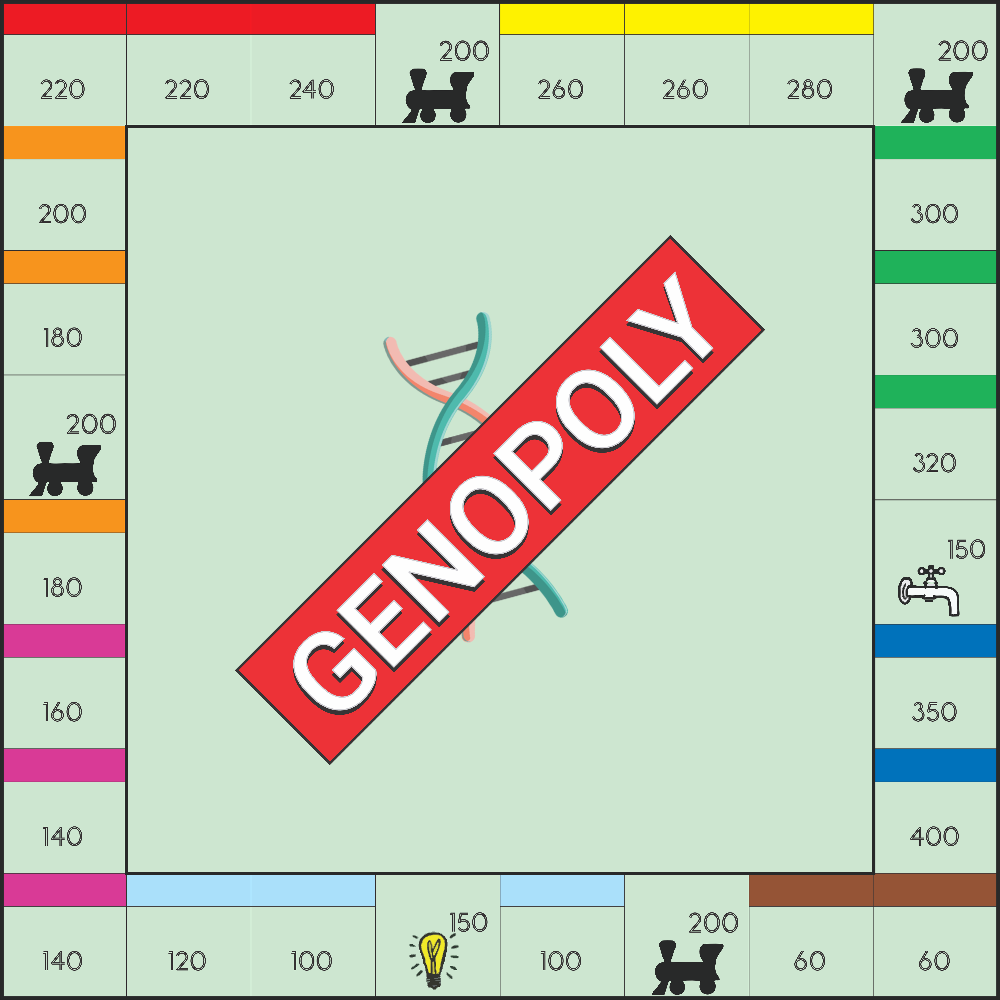

<h2 align="center">
  GENOPOLY
</h2>

<h1 align="center">
    
</h1>

  

  
  
  

  

  

  <a href="#about">About</a>&nbsp;&nbsp;&nbsp;|&nbsp;&nbsp;&nbsp;
  <a href="#configs">Configs</a>&nbsp;&nbsp;&nbsp;|&nbsp;&nbsp;&nbsp;
  <a href="#license">License</a>&nbsp;&nbsp;&nbsp;|&nbsp;&nbsp;&nbsp;

 

## About

This is an implementation of Monopoly Board Game to simulate strategy would be better at using genetic algorithm.
## GA against pre-set profiles

At first we have 4 profiles:
- Cautious: only buys a property if his remaining balance is equal or greater than a value;
- Demmanding: only buys the property if his rental value is superior to a certain value;
- Impulsive: if he has coins enough, buys the property;
- Random: decides randomly to buy or not a property.
- GA:

## GA against ga

This implementation of Monopoly also supports simulations where the players (5) are all GA.
## Configs

Each value of monopoly game used in this simulation can be set in de `config.json` file.
For GA, check `ga_against_ga.py` and `ga_against_profiles.py`.
## GA player

The GA player has coeficients to evaluate 4 parameters of monopoly:

- same color (full set)
- remaining balance
- min rent price
- impulsivity
## Game Mechanics Implemented

- Buy property
- Pay rent
- Bankrupcy
- Pay taxes
- Full set
## Game Mechanics That May Be Implemented In The Future

- Metro Station
- Go to jail
- Luck cards
- Safe cards
- Banker

### How to

- install python 3
- install pip
- clone repository
- `pip install -r requirements.txt`
- run python3 ga_against_ga.py
- run python3 ga_against_profiles.py

After that you should take a look at the logs folder.
## License

This project uses the MIT license. Read [LICENSE](LICENSE.txt) for details.
